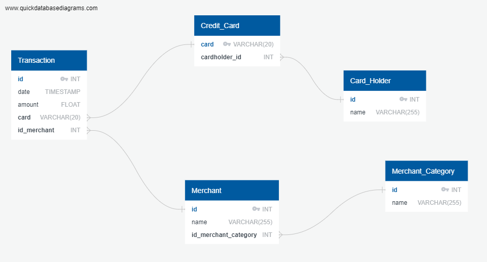

# UW FinTech Bootcamp HW #07

## Data Engineering 
Created the corresponding SQL tables in 'tables.sql' file folder. Used direct imports in pgAdmin4 for the importation of the .csv files containing the data types. Future to code in import. 

The entity relationship diagram (ERD):  

## Data Analysis 

### Part 1 

- How cam you isolate (or group) the transactions of each cardholder? 
There are a variety of ways to isolate the transactions of the card number. The transactions can be isolated  merchant_id and corresponding links (i.e. a specific bar or restaurant), timestamp, or amount. 
- Count the transactions that are less than $2.00 per cardholder.

- Is there any evidence to suggest that a credit card has been hacked? Explain your rationale.

- What are the top 100 highest transactions made between 7:00 am and 9:00 am?
Coffee shops 

- Do you see any anomalous transactions that could be fraudulent?

- Is there a higher number of fraudulent transactions made during this time frame versus the rest of the day?

- If you answered yes to the previous question, explain why you think there might be fraudulent transactions during this time frame.

### Part 2 

- What difference do you observe between the consumption patterns? Does the difference suggest a fraudulent transaction? Explain your rationale.

- Are there any outliers for cardholder ID 25? How many outliers are there per month?

- Do you notice any anomalies? Describe your observations and conclusions.